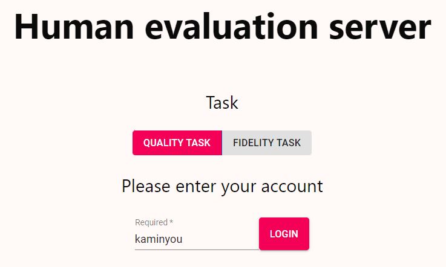

# Computer-Vision-Research-Human-Evaluation-Server
A well-developed full-stack server for human evaluation study in computer vision research.


## Quick start
A `Dockerfile` is prepared for quick start.
1. Before you build the docker image, please modify `SERVER_URL` in `frontend/src/config.json` to match your environment.
2. Build docker image
```
./build.sh
```
3. Run the docker container
```
docker run -p 9090:9090 -it cvserver
```
4. The server will run on port `9090`

## Customize
1. We recommend you use docker and install `nginx` in it.
2. Configure `nginx` config.
```
server {
        listen 9090 default_server;
        listen [::]:9090 default_server;

        root /var/www/html;

        index index.html index.htm index.nginx-debian.html;

        server_name _;
        location ^~ /api/ {
                proxy_pass http://127.0.0.1:9292;
                proxy_set_header Host $host;
        }
}
```
3. Build the frontend server and move everything in `frontend/build/*` into `/var/www/html/` or somewhere you specifiy in the config.
4. Run the backend server.